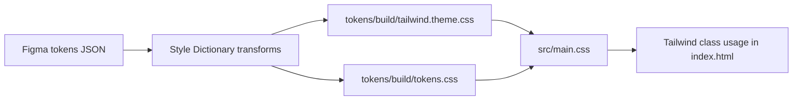

# Figma tokens to Tailwind

A minimal starter that turns Figma design tokens into Tailwind utility classes with Style Dictionary.

## Why this repo exists

This repo isolates the token pipeline from theme/component complexity so the architecture is easy to understand, test, and reuse.

## Architecture



## Project structure

```text
.
├── index.html
├── package.json
├── scripts/
│   └── build-tokens.js
├── src/
│   └── main.css
├── style-dictionary.config.js
└── tokens/
    ├── figma-tokens.json
    └── build/
```

## Setup

```bash
npm install
npm run dev
```

Open the local Vite URL and review the generated token-based classes.

## Showcase behavior

The showcase page is intentionally design-system-agnostic:

- It discovers available CSS token variables at runtime.
- It renders color swatches and token-to-utility mapping dynamically.
- Typography samples are generated from discovered typography tokens.
- Theme toggle applies a temporary color override layer to prove live token-driven updates.

## Commands

```bash
npm run dev          # Build tokens, then run local dev server
npm run build        # Build tokens, then create production build
npm run preview      # Preview production build
npm run tokens:build # Build token outputs only
npm run tokens:watch # Watch token JSON and rebuild outputs
```

## Token profile support

The transform layer supports a profile switch:

- `generic` (default): keeps token naming mostly intact
- `material`: applies Material-style prefix cleanup

Example:

```bash
TOKEN_PROFILE=material npm run tokens:build
```

## GitHub Pages deployment

This repo includes a workflow at `.github/workflows/deploy.yml` that deploys on every push to `main`.

One-time repository setup:

1. In GitHub, open `Settings > Pages`.
2. Under `Build and deployment`, set `Source` to `GitHub Actions`.
3. Push to `main` and wait for the `Deploy to GitHub Pages` workflow.

Notes:

- `vite.config.js` auto-sets `base` from `GITHUB_REPOSITORY` only in GitHub Actions.
- Local development keeps the root base path (`/`) and requires no extra flags.

## Future migration notes

When you move to your custom Figma design file:

1. Replace `tokens/figma-tokens.json` with your exported token file.
2. Keep `TOKEN_PROFILE=generic` unless your naming requires profile rules.
3. Update `normalizeColorKey` in `style-dictionary.config.js` if needed.
4. Add or remove utility examples in `index.html` to match your system.
